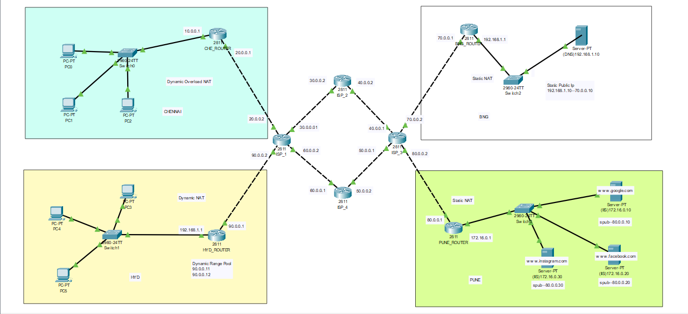
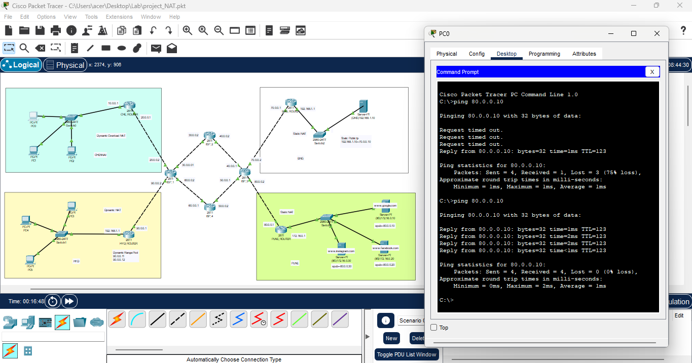
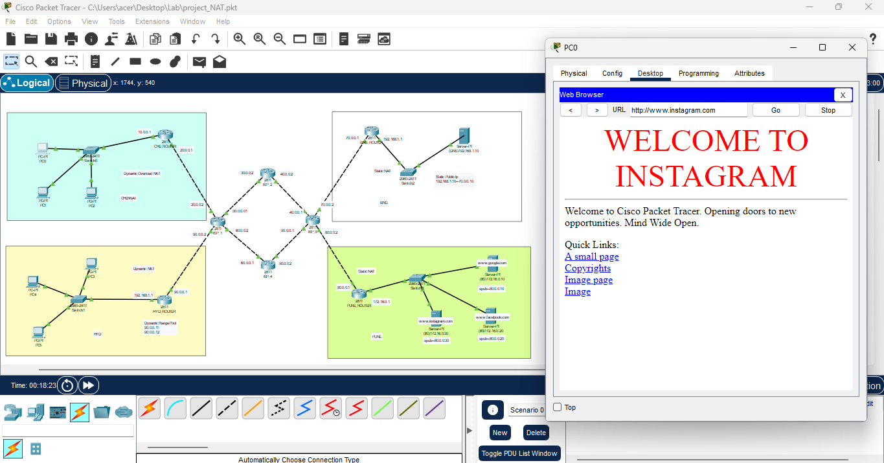
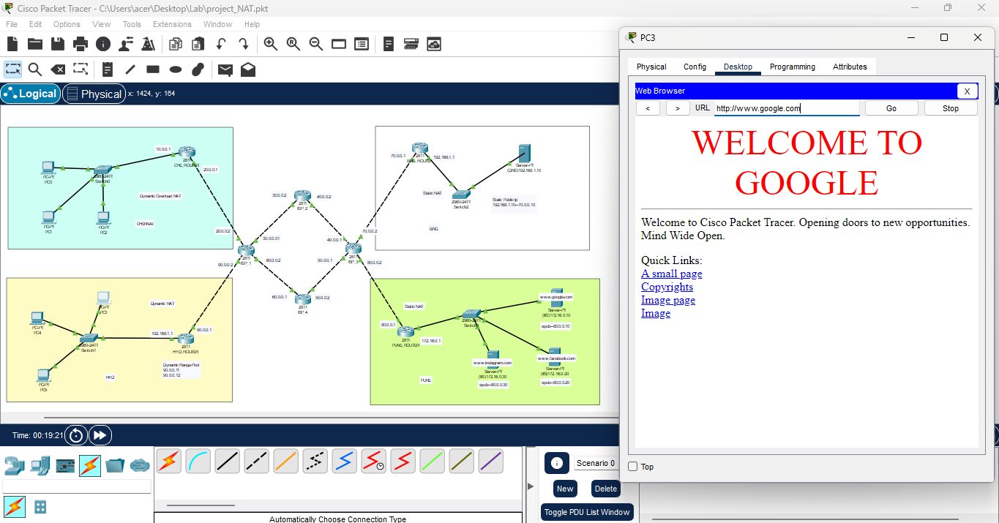

# Enterprise WAN Architecture with NAT

A Cisco Packet Tracer project that simulates a multi-site enterprise Wide Area Network (WAN) connecting geographically distributed branch offices through an ISP backbone. The project demonstrates enterprise-grade Network Address Translation (NAT) techniques, including **Dynamic NAT**, **Static NAT**, and **PAT (NAT Overload)**, enabling secure Internet access, efficient IPv4 address utilization, and public service hosting.

---

## Project Overview

This project models a real-world enterprise WAN where multiple branch offices communicate through an ISP infrastructure while accessing public services. It demonstrates WAN routing, Dynamic NAT, Static NAT, PAT, DNS resolution, and web hosting using Cisco networking devices.

---

## Network Topology



---

## Features

- Multi-Site Enterprise WAN Architecture
- ISP Backbone Connectivity
- Dynamic NAT
- Static NAT
- PAT (NAT Overload)
- DNS Server Configuration
- Public Web Server Hosting
- Branch Office Connectivity
- End-to-End Network Verification
- Enterprise Routing Infrastructure

---

## Network Architecture

### Branch Offices

- Chennai Branch
- Hyderabad Branch
- Bangalore Branch
- Pune Branch

### ISP Network

- ISP Core Routers
- WAN Connectivity Between Sites

### Network Services

- Dynamic NAT
- Static NAT
- PAT (NAT Overload)
- DNS
- HTTP Web Hosting

---

## NAT Implementation

| NAT Type | Purpose |
|----------|---------|
| Dynamic NAT | Maps private IP addresses to a pool of public IP addresses |
| Static NAT | Maps internal servers to fixed public IP addresses |
| PAT (NAT Overload) | Allows multiple devices to share a single public IP address |

---

## Technologies Used

- Cisco Packet Tracer
- Cisco IOS CLI
- IPv4 Addressing
- Dynamic NAT
- Static NAT
- PAT (NAT Overload)
- WAN Routing
- DNS
- HTTP
- Enterprise Networking

---

## Project Files

| File | Description |
|------|-------------|
| `Project_NAT.pkt` | Cisco Packet Tracer project file |
| `Topology_Design.png` | Enterprise WAN topology |
| `Output_1.png` | NAT connectivity verification |
| `Output_2.png` | Public website accessibility |
| `Output_3.png` | Public web server verification |
| `README.md` | Project documentation |

---

## Verification

The project successfully demonstrates:

- ✅ Dynamic NAT Translation
- ✅ Static NAT Configuration
- ✅ PAT (NAT Overload)
- ✅ Branch-to-Branch Connectivity
- ✅ Internet Access
- ✅ DNS Name Resolution
- ✅ Public Website Accessibility
- ✅ End-to-End WAN Communication

### NAT Connectivity Verification



### Website Accessibility



### Public Server Verification



---

## Real-World Applications

This architecture is similar to enterprise networks deployed in:

- Corporate Organizations
- Banking Networks
- Educational Institutions
- Government Agencies
- IT Service Companies
- Multi-Branch Enterprises

---

## Learning Outcomes

- Enterprise WAN Design
- Network Address Translation (NAT)
- Dynamic NAT Configuration
- Static NAT Configuration
- PAT (NAT Overload)
- WAN Routing
- DNS Configuration
- HTTP Server Configuration
- Cisco IOS CLI
- Enterprise Network Troubleshooting

---

## Prerequisites

- Cisco Packet Tracer 8.x or later
- Basic understanding of:
  - Computer Networks
  - IPv4 Addressing
  - Routing
  - Cisco IOS CLI
  - NAT Concepts

---

## How to Run

1. Clone the repository.

```bash
git clone https://github.com/praveen272004/Enterprise-WAN-Architecture-with-NAT.git
```

2. Open `Project_NAT.pkt` using Cisco Packet Tracer.

3. Run the project in **Realtime** or **Simulation** mode.

4. Verify:
   - Dynamic NAT translations
   - Static NAT mappings
   - PAT (NAT Overload)
   - Branch-to-branch connectivity
   - DNS name resolution
   - Website accessibility

---

## Case Study

A growing enterprise with branch offices in Chennai, Hyderabad, Bangalore, and Pune requires secure Internet connectivity while efficiently utilizing limited public IPv4 addresses. This project simulates an ISP-connected WAN where Dynamic NAT and PAT provide Internet access for employees, while Static NAT publishes internal web servers for external access. The solution demonstrates scalable WAN design, efficient address translation, and reliable communication across geographically distributed locations.

---

## Author

**Praveen M**

---

⭐ If you found this project useful, consider giving it a **Star** on GitHub!
